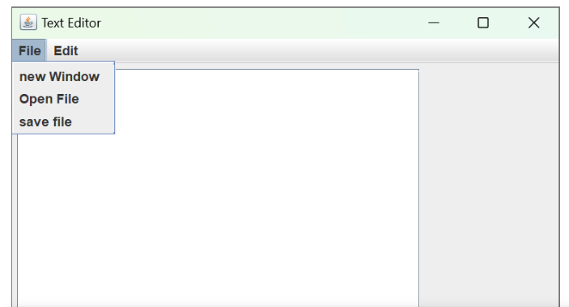

# Text-Editor
# **Text editor Intro**
* The project involves building a text editor in Java, using Java Swing for creating a graphical user interface.
* The text editor will have a window (frame) with a menu bar, consisting of two menus - file menu and edit menu.
* The file menu will have features like new window, save file and open file.
* The edit menu will have five functions - Cut, Copy, Paste, select All and Close button.
* The text area inside the window will be used for writing and editing the text.
* The project demo shows a simple text editor created using Java Swing, with two menus (file and edit) and multiple features within each menu.
* Users can write and edit text inside the text area.

# **Text editor Building UI**
* we will be creating a basic UI for a text editor project in Java using Java Swing components.
* We are creating a new project in Intellij for the text editor and naming it text data".
* We select Java as the language and Intellij as the build system, and choose Open JDK 8 as the preferred JDK version.
* we refactor the main class to be called "text editor".
* we create a constructor for the text editor class and call it in the main function to create an instance of the text editor application.
* To create an application window, we use the Jframe class from the Java Swing package.
* we declare a data member "frame" and initialize it as a new Jframe with dimensions 400x400.
* we make the frame visible and set the layout.
* The resulting application window is a simple window with dimensions 400x400.

# **Text editor Adding Action Listeners**
* Action Listener classes and action events. The current project has a basic UI with menus and a text area, but clicking on the menu items does not result in any action.
* Action events occur when a button is clicked or a checkbox is checked/unchecked, or a menu item is selected. To listen to these action events, we need to implement the Action Listener class and override its action performed method. In the action performed method, we define the action to be taken when a specific action event occurs, based on the event source.
* To implement this in our text editor class, we need to implement the action performed method from the Action Listener interface and override it.

# **Text editor Adding File Menu Functionalities**
* implement file menu functionalities.
* The file menu has three features: new window, open file, and save file.
* The open file feature will be built first, followed by the save file feature.
* The structure of open file and save file is similar, so they will be built together.
* To open a file, a file chooser is triggered by clicking on the open menu item.
* The user must select the file path and file to open and click on the open button.
* The text contained in the file will be copied and pasted into the text area.
* When the open button is clicked, an action event is triggered.
* The action performed method listens to the action event.
* The JFileChooser class is used to open the file chooser.
* When the save button is clicked, the text inside the text area is saved to the file.
* The first step in the open file function is to open the file chooser.
  

# **Text editor Adding File Menu Functionalities**
* implementing file menu functionalities, specifically the save file functionality.
* The save file functionality is similar to the open file functionality in terms of selecting the file path and name using a file picker.
* The difference is that instead of copying and pasting the text to the text area, the save file functionality gets the text from the text area and saves it to a new file.
* To implement the save file functionality, a new "if" statement is created to check if the action event source is the save file functionality.
* A file chooser is initialized to select the file path and name using the show save dialog method, which displays a save button as the approve option.
* A new file is created with the chosen directory path and file name using the File object.
* The text from the text area is saved to the new file.
 

